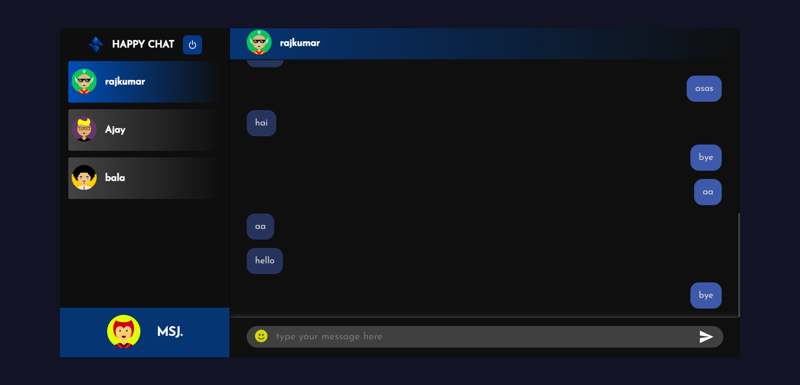

# Happy Chat App
Welcome to the Secure Chat Application repository! This project aims to provide a safe and private communication platform through end-to-end encryption, ensuring that conversations remain confidential and secure.

## Overview
Developed with security in mind, this chat application allows two individuals to exchange messages without the risk of 
unauthorized access. The encryption technology ensures that only the intended recipients can read the messages, providing a high level of privacy.

## Features
- End-to-end encryption for all messages exchanged.
- Real-time communication between two individuals.
- User-friendly interface for easy navigation and interaction.
- Robust security measures to prevent unauthorized access.
- Minimalistic design for a distraction-free experience.

## Tech Stack
- Frontend: React JS, HTML, CSS
- Backend: Node.js, Express.js
- Database: Mongo DB
- Encryption: Socket.io

## Key Features
- End-to-end encryption ensures message privacy.
- Real-time updates for instant communication.
- Intuitive interface for ease of use.
- Secure login and registration process.

## Get Started
1. Clone this repository: `git clone https://github.com/Jaganath-MSJ/Happy-Chat-App.git`
2. Navigate to the project directory: `cd Happy-Chat-App`
3. Navigate to Frontend: `cd public`
4. Install dependencies: `npm install`
5. Start frontend: `npm start`
4. Navigate to backend: `cd server`
5. Start the server: `node index.js`
6. Open the app in your browser: `http://localhost:3000`

## Demo:
For a live demonstration, you can visit [Demo Link](https://happychat-app.netlify.app).

## Contact:
Feel free to reach out to me via email at [jagan.msjc@gmail.com](mailto:jagan.msjc@gmail.com) or connect on [LinkedIn](https://www.linkedin.com/in/jaganathms).

## Thanks To
[Netlify](https://www.netlify.com) for frondend

[Render](https://render.com) for backend